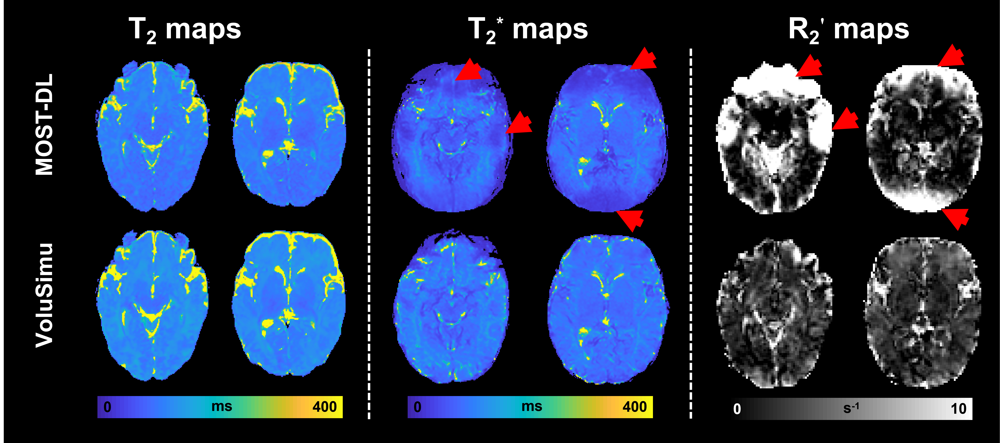

# VoluSimu-MOLED: Ultrafast infant brain qMRI using overlapping-echo acquisition with volumetric physical simulation of slice-level non-idealities
**Contact**: Nuowei Ge (nuoweige@stu.xmu.edu.cn)
## Related Paper
Ultrafast Infant Brain Quantitative MRI Using Overlapping-Echo Acquisition with Volumetric Physical Simulation of Slice-level Non-Idealities.

**IEEE Transactions on Biomedical Engineering**: under major revision

## Method pipeline

**VoluSimu**: a high-precision and fast volumetric physical simulation method for synthetic data-driven deep learning reconstruction, which allows physics-informed synthetic MR image generation with explicit modeling of slice-level non-idealities. 

## VoluSimu-MOLED for Infant qMRI (T2, T2*, and T2′)
***Compared with MOST-DL and other existing studies, the proposed VoluSimu incorporates volumetric simulations of slice-level non-idealities for the first time.***

VoluSimu-MOLED effectively corrects for the effects of non-ideal imaging factors and enables robust T2' mapping for infant brain.

## Code Directory Overview

`Deep_Learning_quantitative_reconstruction` : An end-to-end mapping from SE-MOLED/GRE-MOLED to T2/T2* mapping for infant brain. Trained models are included and can be directly used for inference.

`code_train_real_data_process` : Processing synthetic training data and real-scan data, including .out data generated by SMRI simulation and .mat data obtained by Siemens scanner. We provide example synthetic and real datasets in the `Data` folder. After preprocessing the data in the `Data` folder using the `realdata_preprocess` script, the processed data can be directly used for quantitative reconstruction with the models in the `Deep_Learning_quantitative_reconstruction` module.

`SMRI_for_VoluSimu` : **Compiled SMRI Platform** — specifically built for generating 2D synthetic datasets from volumetric bloch simulation for deep learning. For detailed usage and configuration instructions, please refer to the internal README.

## Dependencies

**Deep Learning**: Python (version 3.6.3) and PyTorch library (version 1.8.0)

**Pre/Post-processing**: MATLAB R2024a

**GPU**: NVIDIA GeForce RTX 4090
